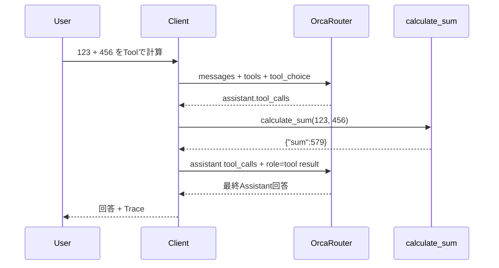

# Advanced API tests

このリポジトリでは、基本Chatに加えて、OrcaRouter側から案内された検証項目を3つの実装で比較できるようにしています。

- API compatibility / paid model switching
- Streaming
- Tool Calling
- Error handling

公式ドキュメント:

- Streaming: https://docs.orcarouter.ai/advanced/streaming
- Tool calling: https://docs.orcarouter.ai/advanced/tool-calling
- Errors: https://docs.orcarouter.ai/operations/errors
- Models: https://www.orcarouter.ai/models

## 1. API compatibility / paid models

3実装とも、Model欄は固定値ではありません。

既定値:

```text
orcarouter/free
```

有料モデルを検証するときは、Model欄を利用可能なモデルIDへ変更するだけです。

例:

```text
openai/gpt-4o-mini
```

モデルの提供状況・価格・利用可否は変わるため、実際の検証時にはOrcaRouterのModel catalogを確認してください。

### Compatibility test

同じ質問、同じModeでModelだけを切り替えます。

| Test | Free model/router | Paid model |
|---|---|---|
| Chat | 同じJSON shapeで送信 | 同じJSON shapeで送信 |
| Streaming | `stream: true` | `stream: true` |
| Tool Calling | `tools` / `tool_choice` | `tools` / `tool_choice` |
| Error Trace | HTTP / error envelopeを記録 | HTTP / error envelopeを記録 |

OrcaRouterはOpenAI-compatible APIを提供しているため、サンプル側ではProvider別のHTTPコードに分岐せず、Model IDの変更で比較する設計です。

---

## 2. Streaming

OrcaRouterのOpenAI-compatible Chat Completionsでは、Requestに次を追加します。

```json
{
  "stream": true,
  "stream_options": {
    "include_usage": true
  }
}
```

レスポンスはSSE（Server-Sent Events）です。

```text
data: {...}

data: {...}

data: [DONE]
```

各サンプルは `data:` 行を順番に読み、`choices[0].delta.content` を回答欄へ追加します。

### Web

Browser `fetch()` の `ReadableStream` を読み取ります。

### PowerShell

`HttpClient.SendAsync(..., ResponseHeadersRead)` と `StreamReader` でSSEを1行ずつ読みます。

### VBA

VBA版では Chat / Streaming / Tool Calling を `MSXML2.XMLHTTP.6.0` に統一しています。

Streamingは `.Open "POST", URL, True` で非同期送信し、`readyState = 3 (LOADING)` の間から `responseText` の増分を読みます。受信済み文字数を保持して新しい部分だけを取り出し、改行単位でSSEの `data: {...}` を解析します。

外部PowerShell、`WScript.Shell`、`curl.exe` は使用しません。MSXMLがHTTPのUTF-8レスポンスをVBAのUnicode文字列へ変換した後にAnswerへ書くため、コンソールコードページによる文字化けも避けやすくしています。

### Streaming error

HTTPレスポンス開始後に上流エラーが発生した場合、HTTP Statusはすでに送信済みです。

そのため、OpenAI-compatible streamでは次のように `data:` chunk内の `error` を確認します。

```json
{
  "error": {
    "message": "...",
    "type": "upstream_error",
    "code": ""
  }
}
```

サンプルではSSE chunkに `error` があればStreaming失敗としてTraceへ記録します。

---

## 3. Tool Calling

3実装で同じローカルToolを使います。

```text
calculate_sum(a, b)
```

Tool schema:

```json
{
  "type": "function",
  "function": {
    "name": "calculate_sum",
    "description": "Add two numbers and return the sum.",
    "parameters": {
      "type": "object",
      "properties": {
        "a": { "type": "number" },
        "b": { "type": "number" }
      },
      "required": ["a", "b"]
    }
  }
}
```

Tool Calling Modeの流れ:



このサンプルでは `tool_choice` で `calculate_sum` を明示的に指定し、Tool Callingの互換性を確認しやすくしています。

`orcarouter/free` が `free_quota_exhausted` を返した場合、Tool Callingロジックへ到達する前にOrcaRouter側でリクエストが拒否されています。コードが計算に失敗したわけではありません。このサンプルは意図しない課金を避けるため有料モデルへ自動フォールバックせず、具体的な有料モデルの指定は利用者が明示的に行います。

---

## 4. Error handling

通常のHTTPエラーでは、可能な限り次をTraceへ記録します。

- HTTP Status
- response headers
- `error.message`
- `error.type`
- `error.code`
- `error.metadata`
- `Retry-After`
- raw response
- runtime-specific exception information

OrcaRouterの代表的なStatus:

| Status | 主な意味 |
|---|---|
| 400 | request/schema/guardrail等 |
| 401 | API key |
| 403 | quota / permission / free capacity等 |
| 404 | endpoint/model |
| 425 | model not live yet |
| 429 | rate limit |
| 500 | gateway internal error |
| 502 | upstream chain failure |
| 503 | model/upstream unavailable |

特に403と429は、Statusだけで判断せず `error.code` と `Retry-After` も確認します。

### Learning test ideas

安全に確認しやすいテスト:

1. API keyをダミーのまま送信 → client-side validation
2. Modelを空にする → client-side validation
3. 存在しないModel IDを指定 → model/error responseの確認
4. Tool非対応モデルを指定 → API互換性・error traceの確認
5. Streaming対応モデルでStreaming Mode → SSE traceの確認

意図的に大量リクエストを送りRate Limitを発生させるテストは推奨しません。

---

## 5. Same learning flow

Modeが違っても、トップレベルでは同じ考え方に合わせています。

1. STEP 1 - Validate inputs
2. STEP 2 - Build request
3. STEP 3 - Send HTTP POST
4. STEP 4 - Receive response / stream
5. STEP 5 - Parse / process response
6. STEP 6 - Update UI and trace

Tool CallingのみSTEP 5の中をさらに分けています。

- STEP 5A - Receive tool call
- STEP 5B - Execute local tool
- STEP 5C - Send tool result
- STEP 5 - Parse final assistant answer
