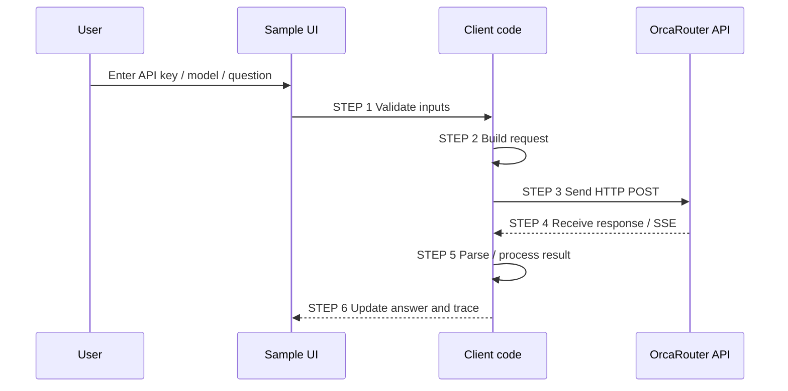

# Common processing flow

All three samples in this repository use the same top-level six processing steps so that learners can compare the implementations side by side. The UI can switch between Chat, Streaming, and Tool Calling.

## API contract

- Endpoint: `POST https://api.orcarouter.ai/v1/chat/completions`
- Authentication: `Authorization: Bearer <API_KEY>`
- Content-Type: `application/json`
- Default model in the samples: `orcarouter/free`
- API key placeholder: `xxx-your-orcarouter-api-key-xxx`

Minimal request:

```json
{
  "model": "orcarouter/free",
  "messages": [
    {
      "role": "user",
      "content": "こんにちは"
    }
  ]
}
```

The assistant reply is read from the OpenAI-compatible response shape:

```text
choices[0].message.content
```

## Six common steps



### STEP 1 - Validate inputs

Check the API key, model name, and question before making an HTTP request.

### STEP 2 - Build request

Create the JSON request body and HTTP headers. The trace always masks the API key.

### STEP 3 - Send HTTP POST

Send the request to OrcaRouter and record the start time.

### STEP 4 - Receive response

For normal Chat and Tool Calling, capture the HTTP status, elapsed time, response headers where available, and raw response body.

For Streaming, read OpenAI-compatible SSE `data:` events until `[DONE]`. If an SSE JSON object contains an `error` field, treat the stream as failed even though the initial HTTP response was successful.

### STEP 5 - Parse / process result

- Chat: read `choices[0].message.content`.
- Streaming: append `choices[0].delta.content` and aggregate usage when returned.
- Tool Calling: read `message.tool_calls`, execute the local `calculate_sum` demo tool, send the `role=tool` result in a second request, then read the final assistant message.

Tool Calling is shown with sub-steps `STEP 5A`, `STEP 5B`, and `STEP 5C` so learners can see the extra round trip.

### STEP 6 - Update UI and trace

Display the assistant answer and add the final processing information to the trace.

## Error and debug policy

The samples intentionally keep more diagnostics than production code normally would.

Each implementation records as much of the following as possible:

- timestamp
- processing step
- direction (`LOCAL`, `REQUEST`, `RESPONSE`, `ERROR`)
- endpoint and model
- masked Authorization header
- request JSON
- HTTP status
- elapsed time
- response headers when available
- raw response body
- exception/error message
- stack trace or runtime-specific error information when available

**Never write a real API key to the trace.**

These samples are designed for learning. Before using the same approach in production, add secret management, retry/backoff, telemetry rules, and application-specific security controls.


## Mode comparison

| Mode | STEP 2 | STEP 4 | STEP 5 |
|---|---|---|---|
| Chat | messages request | JSON response | assistant content |
| Streaming | `stream:true` | SSE events | aggregate deltas |
| Tool Calling | tools + tool_choice | first/second JSON response | tool call → local function → tool result → final answer |

For detailed payloads and official documentation links, see [Advanced API tests](advanced-features.md).
